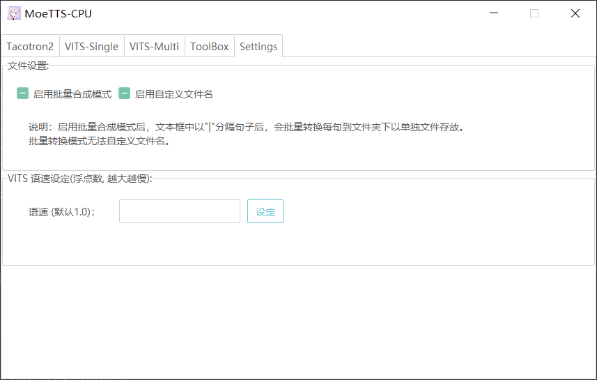
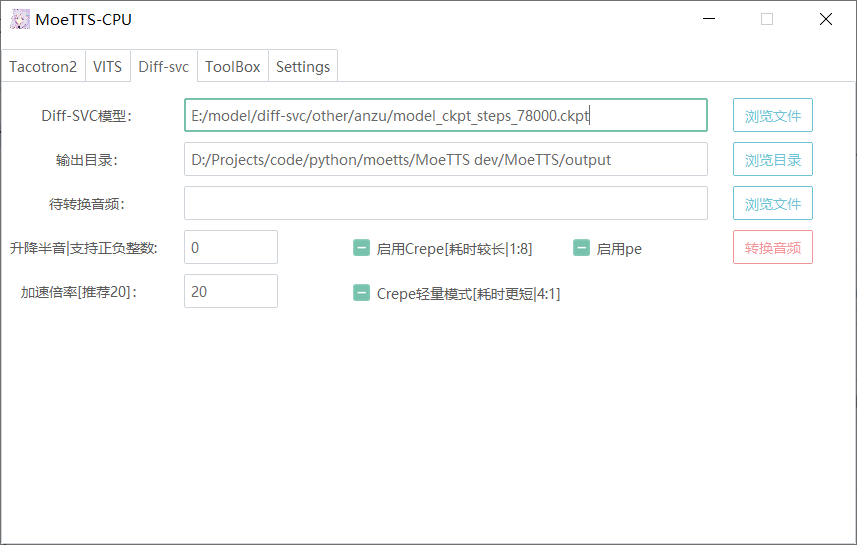

# MoeTTS
Speech synthesis model repo for galgame characters based on Tacotron2 , Hifigan and VITS. The repo is also used to publish precompiled GUI.

**Notice ：** This project is only for AI study and hobby, because of the like of the characters to develop this project, no malicious purpose. If there is infringement, please submit issues, we will immediately remove the associated model.

[简体中文](README.md)   [English](README_en.md)

## About

这是一个存放基于Tacotron2，Hifigan，VITS，Diff-SVC的galgame角色语音合成的模型库的仓库。另外也用于发行编译后的推理GUI。

## 声明：禁止使用该项目以及分享的模型以及衍生产物参与Galgame开发（包括非商业游戏）

## 近期更新

1.2.4：

>1. 增加最近模型与输出路径记录，方便下次打开继续。
>2. 增加完成通知，可以在设置中打开（仅win10）。
>3. 更新diff-svc(12-04版)
>4. 内置了Openvpi的nsf_hifigan权重 (详见：https://openvpi.github.io/vocoders/)

1.2.3-beta:

> 1. 更新diff-svc(同步diffsvc原项目：支持nsf hifigan,增加Crepe缓存，修复了一些BUG)
> 2. 11-22：BUG通知，加载输入音频会覆盖原始wav，记得备份。配置文件开启UV可能导致呼吸声与空白异常。下版本修复。

GPU版请见本仓库“gpu”分支。

## 用户协议

在开源协议的基础上还请遵守以下几点：

1. （重要）不得将本软件、本仓库提供的预训练模型以及衍生产物用于商业目的（例如：带有付费功能的QQ机器人，直接贩售，商业游戏等）对原作进行二次创作不包含在内。
2. 二次创作请遵守原作用户协议，请勿制作会对原作造成不良影响的内容，另外请注明你的作品使用了语音合成，避免造成误会。
3. 本仓库提供的预训练模型及数据部分来自社区，使用造成的一切后果由使用者承担，与本仓库作者及贡献者无关。
4. 禁止使用本仓库任何内容（包括但不限于代码，编译后的exe，预训练模型）进行原创游戏制作。

本项目态度：

1. 本项目仅鼓励合理范围内对原作的二次创作，反对任何对原作以及相关行业的侮辱等不当行为。

## 使用方法

### 模型目录格式

1. 单模型可以放在任意位置，如果模型带有配置文件，请将它重命名为`config.json`（diff-svc请重命名为`config.yaml`）并与模型放置在同一目录。（例如hifigan，vits模型，它们是带有配置文件的）

2. **（TTS模型注意）**1.2.0版本后，你需要将你的模型使用的symbols按以下示例保存为`moetts.json`并与模型放置在同一目录。（如果你不知道该如何进行此步骤，可以参考给出的预训练模型中的配置文件）

   GUI配置文件示例 (atri vits模型使用的配置)（文件名：moetts.json）：

   ```json
   {
   	"symbols":["_", ",", ".", "!", "?", "-", "A", "E", "I", "N", "O", "Q", "U", "a", "b", "d", "e", "f", "g", "h", "i", "j", "k", "m", "n", "o", "p", "r", "s", "t", "u", "v", "w", "y", "z", "\u0283", "\u02a7", "\u2193", "\u2191", " "]
   }
   
   ```
   
   注：**此配置不是训练模型使用的config.json**,是用于指定您的模型训练时所使用的symbols，例如VITS，您可以在`vits/text/symbols.py`中找到使用的symbols，并将它按以上格式保存为json。

### 文本输入格式

文本一般是输入音素（日语在这里应该输入罗马音），但具体要看模型训练者的数据是怎么输入的。比如我的ATRI模型(Tacotron2版本)是输入无空格罗马音，标点符号只支持逗号句号。

**注：v1.2.0后弃用了cleaners，Toolbox中提供了日语与中文的文本到发音转换，其他语言请自行clean后输入。**

### GUI使用方法


选择您的模型路径与输出目录，最后输入待合成文本，点击`合成语音`等待一会软件会将音频输出到`输出目录/outpus.wav`

注意事项：

 1. 首次合成需要加载模型，耗时较长，相同模型再次合成不会再次加载，直接合成。
 2. 如果切换模型，再次合成会重新加载。
 3. 如果修改cleaners与symbols，重新启动软件后才能生效。
 4. 软件为64位版本，不支持32位系统。

VITS特殊说明


1. VITS-Single，VITS-Multi分别为单角色模型与多角色模型
2. VITS-Multi中的原角色ID即待合成语音的角色ID，需要填入数字，目标角色ID为语音迁移功能的待迁移目标角色ID。
3. **待迁移音频需要22050的采样率，16位，单声道。**

## V 1.2.0 更新功能说明

1. Toolbox更新

   1. 加入中文g2p工具
   2. 内置了pyopenjtalk，g2p速度更快，解决gbk编码错误

   

2. 设置更新

   1. 添加批量合成模式
   2. 支持自定义文件名输出
   3. VITS模型支持语速调节
4. 主题选择
   
   

## Beta版本说明

此版本为测试版，用于测试一些新功能，稳定性仅简单测试（win10系统下测试），代码也可能不规范。

### diff-svc



参数说明：

1. 升降半音：默认为0，支持正负整数输入，单位为半音
2. 启用Crepe：该选项可降噪音频，启用后CPU耗时较高，越为原音频时长8倍，建议合成最终版本再开启，干净的音频无需开启。
3. 加速倍率：默认为20，耗时约1:3，预览可使用100，耗时约1：1（该设置会影响音频质量）
4. 待转换音频：wav或ogg纯人声音频，转换后为模型角色音色。

## 在线Demo

Integrated into [Huggingface Spaces ](https://huggingface.co/spaces) using  [Gradio](https://github.com/gradio-app/gradio). Try it out [](https://huggingface.co/spaces/skytnt/moe-tts)

## 模型下载

提交格式参考：

x. 模型名

描述：角色xxx的模型

模型输入：

下载地址：

配套Hifigan模型下载：选填

详细信息：选填

模型类型：


1. ATRI

   描述：游戏 ATRI- My dear moments 的角色ATRI模型

   模型输入：无空格罗马音，标点可保留英文逗号句号。例如：`tozendesu.koseinodesukara.`

   模型下载：链接：https://pan.baidu.com/s/1itDhrhzw6uZYxB2238BzTQ?pwd=0z3u 
提取码：0z3u
   
   详细信息：从游戏中选择1300条语音训练，训练约600 Epoch，训练时罗马音使用Bing翻译API
   
   模型类型：Tacotron2+Hifigan
   
2. ATRI-VITS

   描述：游戏 ATRI- My dear moments 的角色ATRI模型

   模型输入：带有分词与调形标注的罗马音，标点符号可使用`,.?!`。可使用工具箱中的日语g2p(调形标注+ts替换)

   模型下载：

   链接：https://pan.baidu.com/s/1_vhOx50OE5R4bE02ZMe9GA?pwd=9jo4 
   提取码：9jo4

   详细信息：使用VITS训练约 900 Epoch。

   模型类型：VITS

3. Galgame 13位角色

   描述：来自多个galgame的13位角色的模型

   模型输入：带有分词与调形标注的罗马音，标点符号可使用`,.?!`。可使用工具箱中的日语g2p(调形标注+ts替换)

   模型下载（旧版200Epoch）：

   链接：https://pan.baidu.com/s/1fzpC_2YEISvahUzX1iYboA?pwd=yde8 
   提取码：yde8
   
   模型下载（新版700Epoch）：
   
   https://pan.baidu.com/s/1anZ3eusmG8BVhrQQrvlkug?pwd=0i9r 
   提取码：0i9r

详细信息：

​	角色表：0 杏璃 1 杏铃 2 Apeiria 3 明日香 4 ATRI 5 艾拉 6 彩音 7 星奏 8 由依 9 冰织 10 真白 11 美绘瑠 12 二阶堂真红

   模型类型：VITS多角色


diff-svc 模型（此类模型无过多信息，以后采用表格整理）：

| 模型名称与下载                                               | 备注                | 贡献者                                |
| ------------------------------------------------------------ | ------------------- | ------------------------------------- |
| [姬野星奏](https://pan.baidu.com/s/1vc7lLpyAjUDCKI_PO5CR6w?pwd=wad5) | 24000Hz(仅包含推理) | luoyily                               |
| [小鞠由依](https://pan.baidu.com/s/1WwluFplMLjVD9ZeF6qdAxQ?pwd=i4yc) | 24000Hz(仅包含推理) | luoyily                               |
| [ATRI](https://pan.baidu.com/s/1-jc9DSQp_fOv-kdc_4bkyQ?pwd=3jm3) | 24000Hz(仅包含推理) | [RiceCake](https://github.com/gak123) |
| [鹰仓杏铃](https://pan.baidu.com/s/1aBL3geIXJmb7dfEzi4AF5g?pwd=86aq) | 24000Hz(仅包含推理) | luoyily                               |
| [悠音](https://pan.baidu.com/s/18cG-DX38V8LrnFqy83Mzaw?pwd=riwm) | 24000Hz(仅包含推理) | luoyily                               |
| [锦 明日海](https://pan.baidu.com/s/1ZNMn0hRu2MhNeLwQ9_VZ3Q?pwd=xe57) | 24000Hz(仅包含推理) | luoyily                               |
| [美绘瑠](https://pan.baidu.com/s/1lIXXxiAKShxoLkaXOJCdsw?pwd=7c1v) | 24000Hz(仅包含推理) | luoyily                               |
| [艾拉(可塑性记忆)](https://pan.baidu.com/s/14mQfBOAIllqqanP03c5w0g?pwd=z1im) | 24000Hz(仅包含推理) | luoyily                               |
| [伊莉雅](https://pan.baidu.com/s/14v-XkNtp8pDqXXVjljYFSw?pwd=mvh1) | 24000Hz(仅包含推理) | luoyily                               |
| [ATRI_44100](https://pan.baidu.com/s/1KV_SiWUdBZjayyUioPhF3w?pwd=q515) | 44100Hz(仅包含推理) | [RiceCake](https://github.com/gak123) |

注：以上diff-svc模型可能仅包含推理所必要的权重，您可能无法在他们的基础上直接继续训练。

## 常见QA

1. Q：这个GUI能使用非官方Tacotron2或VITS训练的模型吗？

   A：如果模型结构与推理方式没改过的话，只是数据处理不同，应该是没问题的。

2. Q：是否有命令行版本或HttpApi？

   A：可能只会有Windows版。

3. Q：如何获得完整代码？

   A：完整代码请参见dev或其它分支，main分支用于发布模型与GUI。

5. Q：如何训练自己的模型？

   A：本仓库不提供自训练支持，请到本项目使用到的各个原项目中查看帮助。

## 分享模型&参与开发

欢迎分享你的预训练模型，由于模型较大，暂时不打算存放在GitHub，可以拉取该项目后将你的模型下载地址以及信息写在Readme的模型下载部分中。提交PR即可。

如果有任何优化建议或者BUG可以提issue。

如您希望为项目追加新功能并合并到dev分支，请先查看Projects页面，避免PR冲突。

## 感谢名单&项目贡献者

1. **[ShiroDoMain](https://github.com/ShiroDoMain)**：1.0.0 CLI版本开发
2. **[menproject](https://github.com/menproject)**：1.0.0 版本英语自述文件翻译
3. **[CjangCjengh](https://github.com/CjangCjengh/)**：提供编译的g2p工具以及适用于日语调形标注的符号文件。
4. **[skytnt](https://huggingface.co/skytnt)**: 提供了hugging face 在线 demo

## 参考&引用

hifi-gan: https://github.com/jik876/hifi-gan

Tacotron2: https://github.com/NVIDIA/tacotron2

VITS:https://github.com/jaywalnut310/vits

diff-svc:https://github.com/prophesier/diff-svc

DiffSinger:https://github.com/MoonInTheRiver/DiffSinger

DiffSinger(openvpi):https://github.com/openvpi/DiffSinger

DiffSinger 社区声码器企划：https://openvpi.github.io/vocoders/